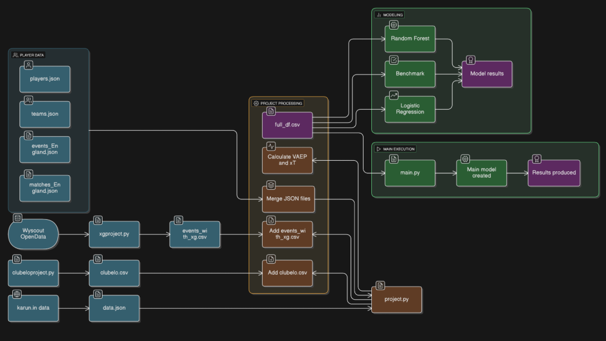
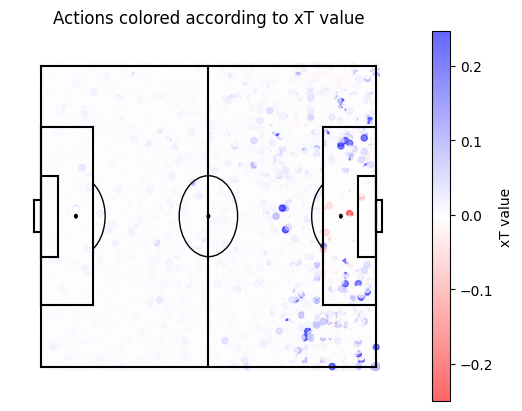
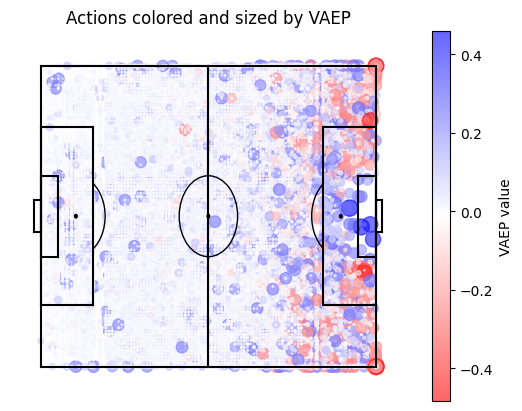
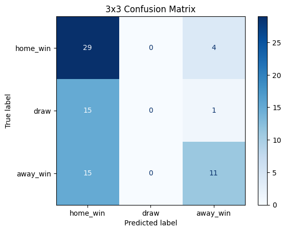
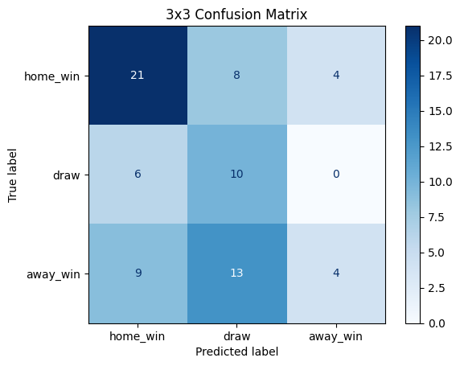
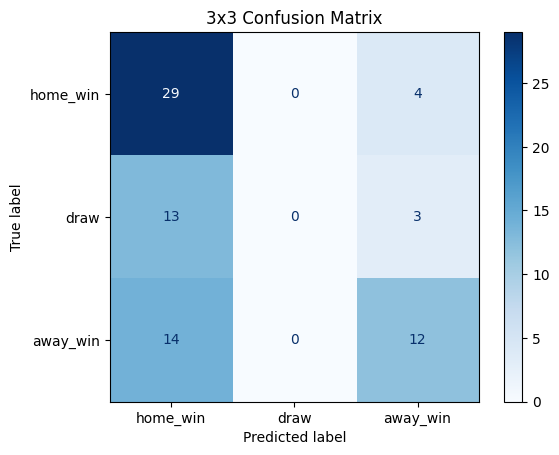
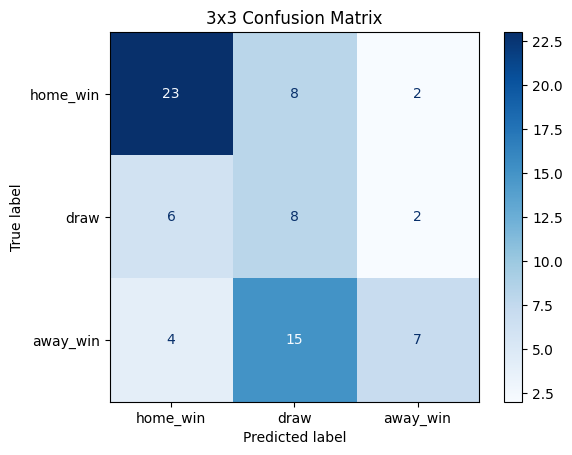
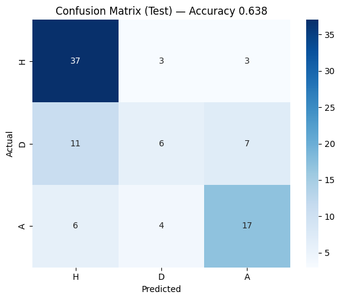
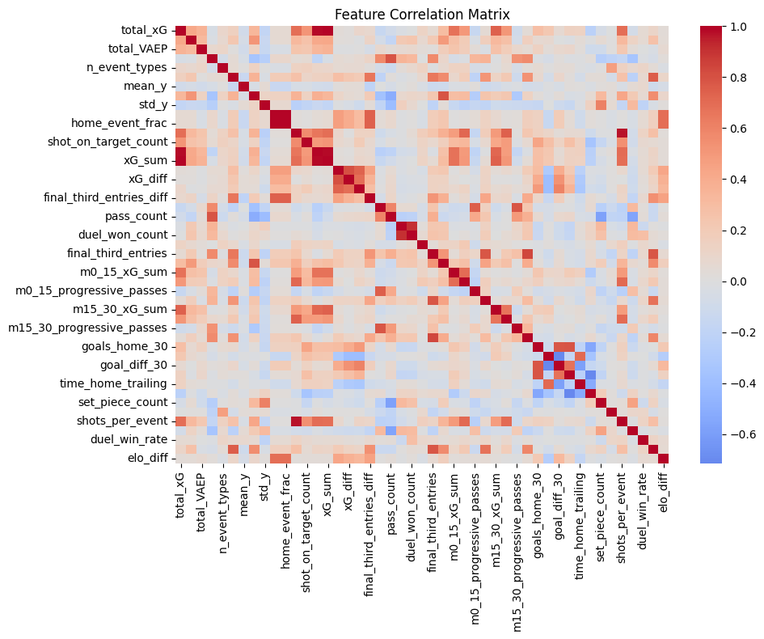

# CSE 552 – Football Match Outcome Prediction (Bayesian Hierarchical Model)

This repository contains the full codebase for the **CSE 552 Project**, which focuses on predicting football match outcomes using **early-match event data** and a **Bayesian hierarchical ordinal logistic regression framework**.

The core idea is to assess how much information the **first 30 minutes of a football match** provides about the final result, using rich event-based features and probabilistic modelling rather than purely score-based or black-box classification approaches.

---

## 📌 Project Overview

Football match outcome prediction is challenging due to high uncertainty, class imbalance (especially draws), and the dynamic nature of in-game events. Traditional machine learning models often prioritise classification accuracy while ignoring probability calibration and uncertainty.

This project proposes a **hybrid Bayesian approach** that:
- Summarises early-match dynamics using event-level data
- Treats match outcomes as an **ordinal variable** (Home Win → Draw → Away Win)
- Separates **pre-match strength** (Elo ratings) from **in-match performance**
- Produces **calibrated probabilistic predictions** with uncertainty estimates

---

## ⚽ Data

- **Source**: Wyscout Open Event Dataset  
  https://github.com/koenvo/wyscout-soccer-match-event-dataset
- **League**: English Premier League
- **Observation Window**: First 30 minutes of each match
- **Coordinate System**: Normalised to a 105m × 68m pitch

### Event-Level Information
Each event includes:
- Event type (pass, shot, duel, etc.)
- Spatial coordinates
- Team ownership (home / away)
- Advanced metrics:
  - Expected Goals (xG)
  - Expected Threat (xT)
  - VAEP

Special care was taken to correctly reconstruct **own-goal events**, which are not explicitly labelled as standard goals in raw Wyscout annotations.

---

## 🧠 Feature Engineering

Features are aggregated at the **match level** from the first 30 minutes:

### Core Metrics
- Cumulative xG, xT, VAEP
- Progressive passes
- Shots and shot quality
- Final-third and penalty-area entries
- Duels, set pieces, cards

### Spatial & Temporal Features
- Mean and variance of x/y coordinates
- Event diversity and volume
- Temporal splits: 0–15 min and 15–30 min
- Game-state features (time leading, trailing, drawing)

### Pre-Match Strength
- Elo rating difference (Home – Away), used as **prior information**

---

## 🧪 Models Implemented

### Baseline Models
- **Score-at-30 benchmark**
- **Random Forest** (two-stage: draw vs winner)
- **Logistic Regression** (two-stage with class weighting)

### Main Model (Proposed)
**Bayesian Hierarchical Ordered Logistic Regression**
- Ordinal response:  
  `0 = Home Win`, `1 = Draw`, `2 = Away Win`
- Team-level random effects (home & away)
- Big-6 specific home advantage
- Elo difference as a prior
- Horseshoe prior for sparse feature effects
- Posterior inference via **Hamiltonian Monte Carlo (NUTS)**

---

## 📊 Evaluation

- Train / test split: **80 / 20** (chronological)
- Metrics:
  - Classification accuracy
  - Confusion matrices
  - Posterior predictive probabilities
  - Prediction entropy (uncertainty)

### Test Accuracy
| Model | Accuracy |
|------|----------|
| Score-at-30 benchmark | 53.2% |
| Logistic Regression | 50.7% |
| Random Forest | 54.7% |
| **Bayesian Ordinal Model** | **63.8%** |

The Bayesian model significantly outperforms classical ML approaches while providing **well-calibrated probabilities** instead of point predictions only.

---

## 📈 Key Findings

- Early-match event data contains substantial predictive information
- Draw outcomes remain the hardest class to model
- Random Forest models tend to collapse draws under class imbalance
- Treating Elo as prior knowledge (not a feature) improves conceptual consistency
- Hierarchical Bayesian modelling improves robustness and interpretability

---

## Figures

### Project Diagram

### xT Graph

### VAEP Graph

### Random Forest without Key Metrics

### Logistic Regression without Key Metrics

### Random Forest with Key Metrics

### Logistic Regression with Key Metrics

### Main Model Correlation Matrix

### Main Model Feature Correlation

---

## 🚀 Future Work

- Symmetry-based features for draw detection
- Player-level random effects
- Adaptive early-match time windows
- Graph-based or spatiotemporal extensions
- Real-time in-play probability updating

---

## TO-DO

## Notes